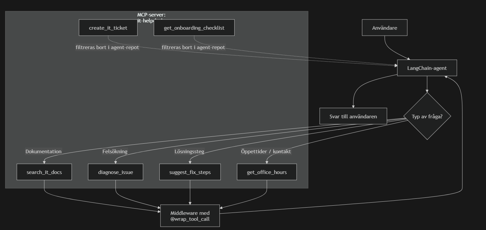

## Getting Started

### Prerequisites
- Python 3.13

### Setup

1. Clone the project
2. Create a virtual environment and install dependencies:
```bash
python3.13 -m venv .venv
source .venv/bin/activate
pip install -r requirements.txt
```

### Running Examples

Make sure the virtual environment is activated and run from the project root:

```bash
source .venv/bin/activate
python -m calculator_mcp.calculator_mcp
```


# IT Helpdesk Agent

## Installera dependencies

### MCP-repo: `nackademin-mcp-demo`
```bash
python -m venv .venv
source .venv/Scripts/activate
pip install -r requirements.txt
```

### Agent-repo: `nackademin-langchain-demo`
```bash
python -m venv .venv
source .venv/Scripts/activate
pip install -r requirements.txt
```

Skapa också en `.env` i `nackademin-langchain-demo`:

```env
OLLAMA_BASE_URL=http://nackademin.icedc.se
OLLAMA_BEARER_TOKEN=DIN_TOKEN_HÄR
OLLAMA_MODEL=llama3.1:70b
```

Agenten försöker automatiskt hitta MCP-servern om reporna ligger bredvid varandra, till exempel:

```text
workspace/
├─ nackademin-mcp-demo
└─ nackademin-langchain-demo
```

Om auto-detekteringen inte fungerar kan man sätta dessa variabler manuellt i `.env`:

```env
IT_HELPDESK_MCP_SERVER_PATH=/path/to/nackademin-mcp-demo/it_helpdesk_mcp/helpdesk_server.py
IT_HELPDESK_MCP_PYTHON=/path/to/nackademin-mcp-demo/.venv/bin/python
```

---

## Starta MCP-servern

I `nackademin-mcp-demo`:

```bash
python it_helpdesk_mcp/helpdesk_server.py
```

---

## Starta agenten

I `nackademin-langchain-demo`:

```bash
python run_it_helpdesk_agent.py
```

---

## Exempelfrågor

### `search_it_docs`
```text
Vad säger dokumentationen om hur man installerar VPN?
```

### `diagnose_issue`
```text
Min laptop hittar inte Wi-Fi, vad kan vara fel?
```

### `suggest_fix_steps`
```text
Ge mig konkreta steg för att lösa ett Wi-Fi-problem på Windows.
```

### `get_office_hours`
```text
När har helpdesken öppet i Stockholm?
```

---

